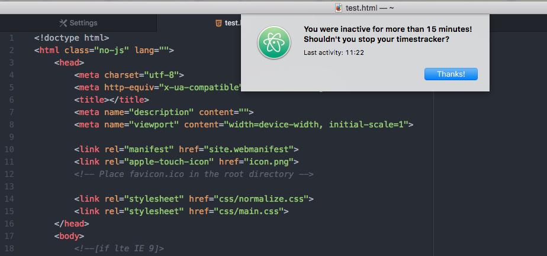
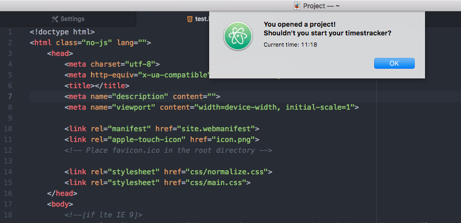

# timetracking-reminder for Atom

timetracking-reminder is a package for Atom that reminds you to start or stop your timetracker.

## Features

- Reminds you to stop your timetracker after some minutes of inactivity
- Reminds you to start or stop your timetracker when openening or closing a project

## Screenshots

## License

Code is licensed under the [MIT license](https://github.com/korridor/timetracking-reminder/blob/master/LICENSE).
